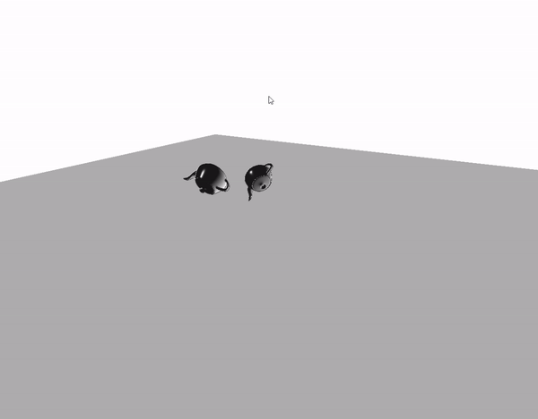

# Tools Scripting Final Task

## 4. Rigid animation for more than object per frame

First we have modified our maxscript code so now it will create a file with the animations of all the objects of the scene. Also we changed the file adding the total number of frames to known where the next animation begins.

Then we modified the animation parser so it will accept more than one animation from one file.

