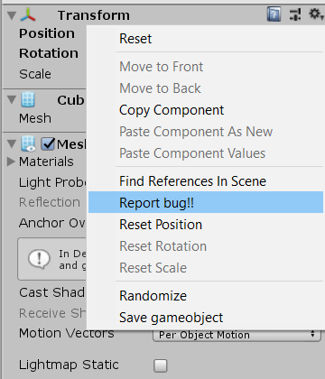
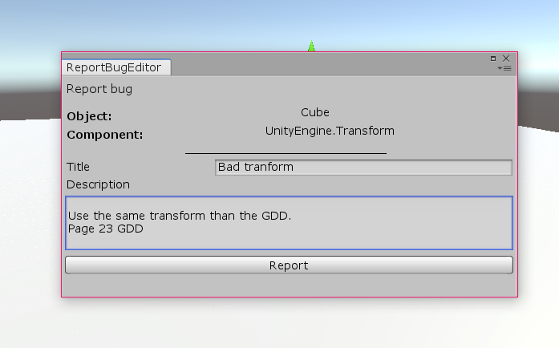

# Tools Scripting Final Task

## 1. Create a menuItem shortcut

For this exercise we have created a tool for reporting bugs of a component in an Object.

First we have created the menuItem in all the components.

Then we have created a GUI where the user can see the component and th object selected, add a title and a description and a button to submit the report.

Once the user has submitted the issue, the tool will create a file in the 'Bugs' directory with all the report info. 

[Script here](MVDTools2/Assets/Editor/Source/ReportBugTool.cs)

## 2. Finish MVD Tool window

We have finished the tool by adding transforms options to the spawn of the objects. If you specify a position(offset), rotation and scale, the object will have this transforms applied. 

##TODO

Also, we have improved the tool, so the user doesn't have to stop and rerun the adding object every time he makes a changes.